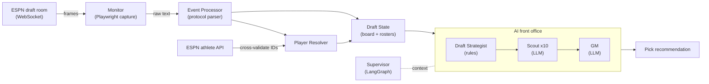

# DraftOps (The Franchise)

**A live draft assistant for ESPN fantasy football: it reverse-engineers ESPN's
undocumented draft-room WebSocket, tracks every pick in real time, and runs a
multi-agent LLM "front office" that tells you who to take next.**

> Archived weekend project (Labor Day weekend, 2025). The goal was to build the
> whole thing in one weekend and use it live in my own draft. I came up just
> short - draft day arrived, the assistant didn't. Retired with the seams
> honestly documented below.

---

## The story

My ESPN draft was right after Labor Day weekend 2025, and I decided the weekend
was enough time to build a draft assistant from scratch. About 60 commits later,
I had most of one.

ESPN's live draft room has no public API. Picks stream over a WebSocket in an
undocumented, space-delimited text protocol. So the project split into two
problems:

### 1. Figure out how to see the draft

Capture a real draft with a browser HAR export -> stare at the frames until the
grammar falls out -> monitor the socket live with a headless browser
(Playwright) -> cross-validate the player IDs against ESPN's public athlete API
so I could trust the decode. This half is the most solid part of the repo.

The decoded grammar (from `event_processor.py`):

```
SELECTED {teamDraftPosition} {playerId} {teamId} {memberId}   # a pick was made
SELECTING {teamId} {timeMs}                                    # team is on the clock
CLOCK {teamId} {timeRemainingMs} {round}                       # clock tick
AUTODRAFT {teamId} {bool}                                      # autopick toggled
```

Favorite gotcha: the first `SELECTED` field looks like an overall pick number
but is actually the team's draft slot (1-10). The kind of thing you only learn
by watching a real draft and being wrong about it first.

### 2. Figure out who to draft

A LangGraph "front office" turns live draft state into a single recommendation:

- **Draft Strategist** (rules-based) - reads roster needs, tier urgency, value
  gaps, positional runs, and scarcity, then allocates a shortlist budget across
  positions.
- **Scout** (LLM) - fans out ~10 parallel calls over the shortlist to surface
  diverse candidates worth considering.
- **GM** (LLM) - takes the Scout's suggestions and commits to one player.
- **Supervisor** (LangGraph `StateGraph`) - holds draft context across the
  whole draft.

Both halves work on their own. The wiring that fuses them into one always-on
loop is where the weekend ran out. I drafted the old-fashioned way, then
archived the project, because the parts I actually wanted to build were done.

## Architecture



## What it looks like

Raw frames off the wire, and what the pipeline makes of them:

```text
# Incoming WebSocket frames (ESPN's text protocol)
SELECTED 2 4362628 4 {member-guid}      # team slot 2 drafted player 4362628
SELECTING 6 30000                        # team 6 now on the clock (30s)
CLOCK 6 17239 1                          # 17.2s remaining, round 1

# After parsing + cross-validating the ID against ESPN's athlete API
Pick  2  ->  Justin Jefferson  (WR, MIN)   [id 4362628]
On the clock: team 6   round 1   0:17 remaining

# Front office, asked for a recommendation at your pick
Strategist:  shortlist budget -> {RB: 6, WR: 5, TE: 2, QB: 1, DST: 1}
Scout (x10): Bijan Robinson, Breece Hall, Garrett Wilson, ...
GM:          DRAFT -> Bijan Robinson (RB, ATL) - best value at your roster's
             biggest need; RB tier drops off before your next pick.
```

*(Illustrative of the real pipeline output - reproducing it needs a live ESPN
draft and player data.)*

## Running it

```bash
python -m venv .venv && source .venv/bin/activate   # Windows: .venv\Scripts\activate
pip install -r requirements.txt
playwright install chromium

pytest                 # test suite (live-API agent tests deselected by default)
pytest -m liveapi      # agent tests that call OpenAI (needs OPENAI_API_KEY)
```

To actually run the live monitor and front office you need a real ESPN
mock/live draft, player-projection CSVs (`draftOps/playerData/`, gitignored),
and `OPENAI_API_KEY` in `.env`. It is very much a
works-on-my-machine-during-one-specific-weekend kind of program.

## How this was built

The other half of the experiment: the whole thing was written with **Claude
Code**, and every pull request was reviewed by two GitHub Actions bots I ran on
my own PRs (both still in `.github/workflows/`):

- **`claude-code-review`** - a first-principles reviewer that approves or
  requests changes on each PR.
- **`bug-bot`** - a second reviewer scoped narrowly to critical runtime bugs.

The commit history keeps the `Co-Authored-By: Claude` trailers on purpose. A
solo dev, two review bots, and a deadline was the workflow I wanted to test as
much as any fantasy football outcome.

## What I learned / limitations

- **Reverse-engineering paid off the most.** HAR capture -> grammar -> live
  decode -> cross-validation against a second source (the athlete API) turned
  out to be a repeatable recipe for an undocumented protocol, and the
  cross-check is what made the decode trustworthy.
- **The two AI halves were never fused.** The `Supervisor` LangGraph and the
  `Strategist -> Scout -> GM` pipeline were each validated on their own, via
  demos and tests, but never welded into one always-on production graph. That
  seam is a big part of why the weekend deadline slipped away, and archiving
  the project meant leaving it visible rather than papering over it.
- **It depends on ESPN not changing anything.** The protocol was decoded
  against the 2025 draft season. ESPN can (and eventually will) change it, at
  which point the monitor needs re-mapping.
- **Test suite:** the protocol/state/recovery tests run under `pytest`; a
  handful of recovery-integration tests are known-failing and tracked in
  `draftOps/docs/stuff-to-clean.md`.
- **No benchmarks, on purpose.** It never ran in a real draft, so there is no
  win rate to report. The number I trust is "the decode cross-validated against
  ESPN's API," and that's the only claim this README makes.

## Layout

```
draftOps/src/                     # import root
├── websocket_protocol/           # the "how do we see the draft" half
│   ├── monitor/                  #   Playwright WebSocket capture + reconnect
│   ├── state/                    #   protocol parser + draft-state tracking
│   ├── api/  utils/              #   ESPN athlete API client + ID cross-validation
│   └── scripts/                  #   runnable monitors/loggers
├── ai/                           # the "who do we draft" half
│   ├── core/                     #   draft_strategist, scout, gm, draft_supervisor
│   └── managers/                 #   wires the Supervisor into the live state manager
└── data_loader.py                # player/ADP data model + name normalization
draftOps/docs/                    # sprint specs + the WebSocket protocol analysis
```

## License

MIT - see [LICENSE](LICENSE).
