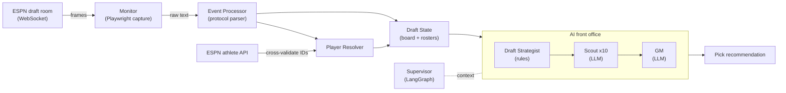

# DraftOps (The Franchise)

**A real-time draft assistant for ESPN fantasy football: it reverse-engineers ESPN's
undocumented draft WebSocket, tracks every pick live, and runs a multi-agent "front
office" that recommends who to draft next.**

> Retired weekend project (Aug-Sep 2025), archived. *Retired, not abandoned* - it did
> its job for the 2025 draft season, then I put it down. Built solo over a weekend
> sprint (~60 commits) as an exercise in protocol reverse-engineering and multi-agent
> LLM orchestration.

---

## The story

ESPN's live draft room has no public API. Picks stream over a WebSocket in an
undocumented, space-delimited text protocol. So the project was built in two halves:

**1. Reverse-engineer the protocol.**
Capture a real draft with a browser HAR export -> map the message grammar -> monitor
the WebSocket live with a headless browser -> cross-validate the player IDs against
ESPN's public athlete API to make sure the decode was correct.

The decoded grammar (see `event_processor.py`):

```
SELECTED {teamDraftPosition} {playerId} {teamId} {memberId}   # a pick was made
SELECTING {teamId} {timeMs}                                    # team is on the clock
CLOCK {teamId} {timeRemainingMs} {round}                       # clock tick
AUTODRAFT {teamId} {bool}                                      # autopick toggled
```

**2. Build a "front office" that drafts.**
A team of agents turns the live draft state into a single pick recommendation:

- **Draft Strategist** (rules-based) - reads roster needs, tier urgency, value gaps,
  positional runs, and scarcity, then allocates a "shortlist budget" across positions.
- **Scout** (LLM) - fans out ~10 parallel calls over the shortlist to surface diverse
  candidates worth drafting.
- **GM** (LLM) - aggregates the Scout's picks into one final decision, validated
  against the live board.
- **Supervisor** (LangGraph `StateGraph`) - maintains draft context across the whole
  draft and drives the live recommendation loop.

## Architecture



## What it looks like

Raw frames off the wire, and what the pipeline makes of them:

```text
# Incoming WebSocket frames (ESPN's text protocol)
SELECTED 2 4362628 4 {member-guid}      # team slot 2 drafted player 4362628
SELECTING 6 30000                        # team 6 now on the clock (30s)
CLOCK 6 17239 1                          # 17.2s remaining, round 1

# After parsing + cross-validating the ID against ESPN's athlete API
Pick  2  ->  Justin Jefferson  (WR, MIN)   [id 4362628]
On the clock: team 6   round 1   0:17 remaining

# Front office, asked for a recommendation at your pick
Strategist:  shortlist budget -> {RB: 6, WR: 5, TE: 2, QB: 1, DST: 1}
Scout (x10): Bijan Robinson, Breece Hall, Garrett Wilson, ...
GM:          DRAFT -> Bijan Robinson (RB, ATL) - best value at your roster's
             biggest need; RB tier drops off before your next pick.
```

*(Illustrative of the real pipeline output; player data and a live ESPN draft are
required to reproduce it.)*

## Layout

```
draftOps/src/                     # import root
├── websocket_protocol/           # the "how do we see the draft" half
│   ├── monitor/                  #   Playwright WebSocket capture + reconnect
│   ├── state/                    #   protocol parser + draft-state tracking
│   ├── api/  utils/              #   ESPN athlete API client + ID cross-validation
│   └── scripts/                  #   runnable monitors/loggers
├── ai/                           # the "who do we draft" half
│   ├── core/                     #   draft_strategist, scout, gm, draft_supervisor
│   └── managers/                 #   wires the Supervisor into the live state manager
└── data_loader.py                # player/ADP data model + name normalization
draftOps/docs/                    # sprint specs + the WebSocket protocol analysis
```

## Running it

```bash
python -m venv .venv && source .venv/bin/activate   # Windows: .venv\Scripts\activate
pip install -r requirements.txt
playwright install chromium

pytest                 # test suite (live-API agent tests deselected by default)
pytest -m liveapi      # agent tests that call OpenAI (needs OPENAI_API_KEY)
```

The live monitor and the front office need a real ESPN mock/live draft, player-projection
CSVs (`draftOps/playerData/`, gitignored), and `OPENAI_API_KEY` in `.env`.

## How this was built

This was an experiment in AI-assisted development as much as in fantasy football. It was
written with **Claude Code**, and every pull request was reviewed by two GitHub Actions
bots I ran on my own PRs (still in `.github/workflows/`):

- **`claude-code-review`** - a first-principles reviewer that approves or requests
  changes on each PR.
- **`bug-bot`** - a second reviewer scoped narrowly to critical runtime bugs.

The commit history keeps the `Co-Authored-By: Claude` trailers on purpose - the
human-in-the-loop-with-agents workflow is the point.

## What I learned / limitations

- **Reverse-engineering paid off the most.** HAR capture -> grammar -> live decode ->
  cross-validation against a second source (the athlete API) is a reliable recipe for an
  undocumented protocol, and the cross-check is what made the decode trustworthy.
- **The two AI halves aren't fused.** The `Supervisor` LangGraph and the
  `Strategist -> Scout -> GM` pipeline were each validated on their own (via demos and
  tests) rather than welded into one always-on production graph. Retiring the project
  meant leaving that seam honest rather than papering over it.
- **It depends on ESPN not changing anything.** The protocol was decoded for the 2025
  draft season; ESPN can (and eventually will) change it, at which point the monitor
  needs re-mapping.
- **Test suite:** the protocol/state/recovery tests run under `pytest`; a handful of
  recovery-integration tests are known-failing and tracked in
  `draftOps/docs/stuff-to-clean.md`. No fabricated benchmarks here - the numbers I'd
  trust are "the decode cross-validated against ESPN's API," not a win rate.

## License

MIT - see [LICENSE](LICENSE).
